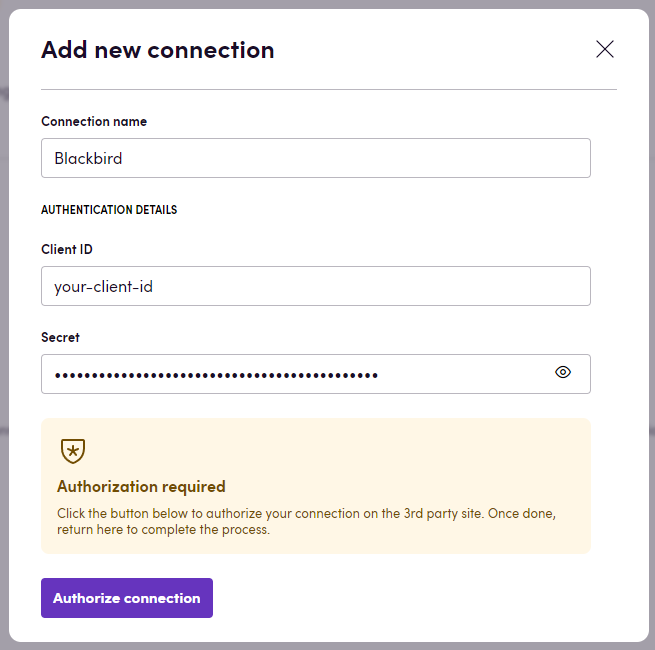
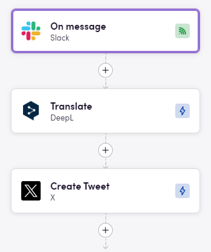

# Blackbird.io X

Blackbird is the new automation backbone for the language technology industry. Blackbird provides enterprise-scale automation and orchestration with a simple no-code/low-code platform. Blackbird enables ambitious organizations to identify, vet and automate as many processes as possible. Not just localization workflows, but any business and IT process. This repository represents an application that is deployable on Blackbird and usable inside the workflow editor.

## Introduction

X is the place to see and join the conversation on what's happening in the world. Follow your interests, share your thoughts, and connect with millions of people.

## Before setting up

Before you can connect you need to make sure that:

- You have a X account and you have the credentials to access it.
- You have `Client ID` and `Client Secret` for the X API.

You can find the instructions on how to create a new app and get the `Client ID` and `Client Secret` [here](https://developer.x.com/en/docs/authentication/oauth-1-0a/api-key-and-secret).

## Connecting

1. Navigate to Apps, and identify the **X** app. You can use search to find it.
2. Click _Add Connection_.
3. Name your connection for future reference e.g. 'My X connection'.
4. Fill in the `Client ID` and `Client Secret` for the X API.
5. Establish **X** connection via OAuth.
6. Click _Connect_.

## Actions

### Tweets

- **Search tweets**: Search tweets by specified parameters. Also, note that we are using `/tweets/search/recent` endpoint, which means that we are searching for the most recent tweet that are up to 7 days old.

When using the `Search tweets` action, you can specify the following parameters:
1. **Max results**:
    - **Description**: This parameter defines the maximum number of results to return. If you do not specify a value, the default is set to 10.
2. **Keywords**:
    - **Description**: This parameter matches a keyword within the body of a tweet. It uses a tokenized match, meaning that your keyword string will be matched against the tokenized text of the tweet body. Tokenization splits words based on punctuation, symbols, and Unicode basic plane separator characters.
3. **Exact phrase match**:
    - **Description**: This parameter matches the exact phrase within the body of a tweet. When enabled, the entire phrase must appear in the tweet exactly as it is specified.
4. **From**:
    - **Description**: This parameter matches any tweet from a specific user. The value can be either the username (excluding the `@` character) or the user’s numeric user ID.
5. **To**:
   - **Description**: This parameter matches any tweet that is in reply to a particular user. The value can be either the username (excluding the `@` character) or the user’s numeric user ID.
6. **Context**:
    - **Description**: This parameter matches tweets with a specific domain ID/entity ID pair. For more information about this operator, please visit the [annotations documentation](https://developer.x.com/en/docs/x-api/annotations/overview).
7. **Language**:
    - **Description**: This parameter filters tweets by language. The language code must be provided according to the BCP 47 standard.
8. **Start time**:
    - **Description**: This parameter specifies the earliest time from which to search for tweets. The time should be provided in ISO 8601 format.
9. **End time**:
    - **Description**: This parameter specifies the latest time until which to search for tweets. The time should be provided in ISO 8601 format.
- **Get tweet**: Get tweet by specified ID.
- **Create tweet**: Create tweet on your twitter page.
- **Delete tweet**: Delete specified tweet by ID.
- **Retweet**: Retweet specified tweet by id and user.
- **Unretweet**: Unretweet specified tweet by id and user.

### Users

- **Get user by username**: Get user by specified username.

## Events

- **On tweets created**: Triggered after specified time interval to check for new tweets.

Note, this event is built around a polling mechanism, which means that the event will be triggered after the specified time interval to check for new tweets. Keep this in mind when using this event in your workflow to avoid exceeding your Monthly Post cap usage. We **strongly** recommend setting the interval to 1 day or more. Additionally, please note that by default, it will return only 10 tweets. You can change this by setting the `Max results` optional input (but be aware that this may affect your Monthly Post cap usage).

## Example

Here is an example of how you can use the X app in a workflow:

In this example, the workflow starts with the **On message** event from `Slack` app which triggers when a new message is posted in the channel. Then, the workflow uses the **Translate** action to translate the message to a specified language. In the next step we use the **Create tweet** action to post the translated message on your twitter page.

## Feedback

Do you want to use this app or do you have feedback on our implementation? Reach out to us using the [established channels](https://www.blackbird.io/) or create an issue.

<!-- end docs -->
